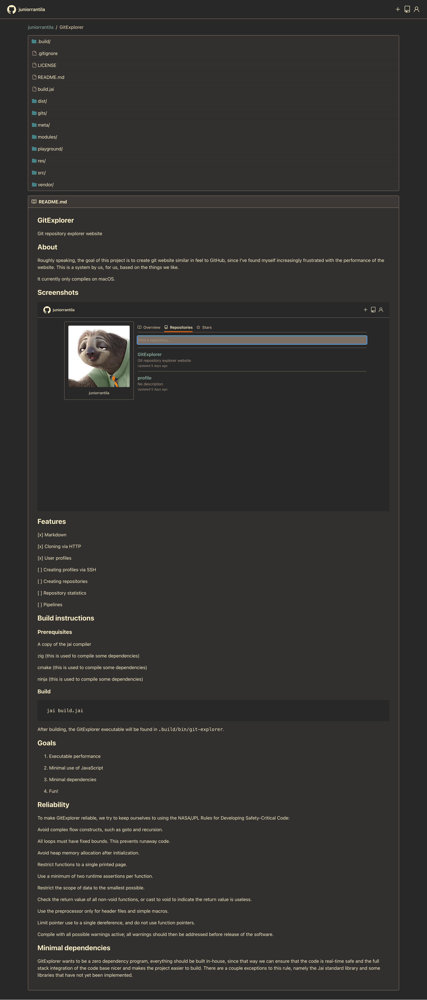

# GitExplorer

Git repository explorer website

## About

Roughly speaking, the goal of this project is to create git website similar
in feel to GitHub, since I've found myself increasingly frustrated with the
performance of the website.
This is a system by us, for us, based on the things we like.

It currently only compiles on macOS.

## Features

- [x] Markdown
- [x] Cloning via HTTP
- [x] User profiles
- [ ] Creating profiles via SSH
- [ ] Creating repositories
- [ ] Repository statistics
- [ ] Pipelines

## Build instructions

### Prerequisites

- A copy of the jai compiler
- zig (this is used to compile some dependencies)
- cmake (this is used to compile some dependencies)
- ninja (this is used to compile some dependencies)

### Build

    jai build.jai

After building, the GitExplorer executable will be found in `.build/bin/git-explorer`.

## Goals

1. Executable performance
2. Minimal use of JavaScript
3. Minimal dependencies
4. Fun!

## Reliability

To make GitExplorer reliable, we try to keep ourselves to using the
NASA/JPL Rules for Developing Safety-Critical Code:

* Avoid complex flow constructs, such as goto and recursion.
* All loops must have fixed bounds. This prevents runaway code.
* Avoid heap memory allocation after initialization.
* Restrict functions to a single printed page.
* Use a minimum of two runtime assertions per function.
* Restrict the scope of data to the smallest possible.
* Check the return value of all non-void functions, or cast to void to indicate the return value is useless.
* Use the preprocessor only for header files and simple macros.
* Limit pointer use to a single dereference, and do not use function pointers.
* Compile with all possible warnings active; all warnings should then be addressed before release of the software.

## Minimal dependencies

GitExplorer wants to be a zero dependency program, everything should
be built in-house, since that way we can ensure that the code is real-time
safe and the full stack integration of the code base nicer and makes the
project easier to build. There are a couple exceptions to this rule, namely
the Jai standard library and some libraries that have not yet been
implemented.

# Screenshots

